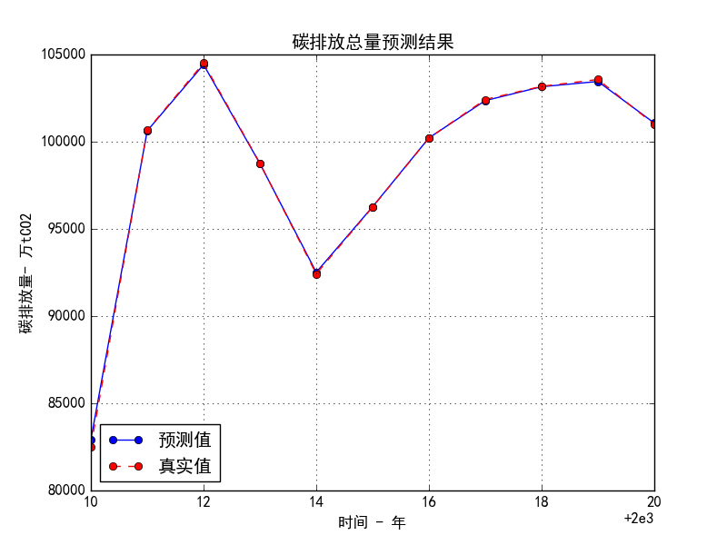

# 2023 hw数学建模

# 分析

问题一 现状分析

建立指标体系，能描经济、人口、能源消费量和碳排放量（四个大指标）的状况，还要描述各个部门的状况，同时考虑指标变化。我们希望可以分析能源利用效率和化石能源占比对碳排放的影响。

碳排放量对GDP总量、人均能源消耗、人均GDP、化石能源消费总量（化石比）

分析现状

碳排放量模型、碳排放量增长率模型

# 模型

<mark>分治归并</mark>。题目要求建立基于 GDP、人口的能源消耗模型，给予 GDP、人口、能源消耗的碳排放模型，同时要求模型与各部门的能源结构、能效等相关联。

> 名字是我起的，别写在论文里

第三问中要求规划路径，我们需要找到可以认为设定的参数，如科技进步导致能源效率提升，政策因素导致第三产业发展与清洁能源推广等。观察到，这些因素对于不同部门的碳排放因子有着不同的影响效果，因此对五部门+居民生活建立了不同的模型。

人口, 各部门GDP 用专有模型预测（时间序列分析）

建立了五部门+居民消费的**能源消耗模型**。其中，各部门的能源消耗预测模型以人口、部门GDP、部门能源强度作为输入；居民生活能源消耗预测模型以人口、总GDP、总能源强度作为输入。使用 xgboost 模型拟合，shap 方法对模型进行解释。

> 其中，部门能源强度可以认为是科技因素，随着科技的提升，单位GDP消耗的能源减少了

建立了五部门+居民消费的**碳排放因子模型**。其中，各部门的碳排放因子模型以各自化石能源占比、非化石能源产热电占比（总）作为输入。使用 xgboost 模型拟合，shap 方法对模型进行解释。

> 碳排放因子模型要考虑到非化石能源占比，但电能作为非化石能源的一种，其本身的碳排放因子一直在变化，原因可以理解为清洁能源用于发电的比重越来越大，因此将非化石能源产热电占比作为输入之一。这两项可以作为政治因素，用于调节最终的碳排放

上述各部门消耗量与各自碳排放系数相称后求和，得到总的预测碳排放量。注意，题目中的总碳排放没有计入能源供应部门碳排放，需要自己加进去。预测碳排放量与实际碳排放对比如下图，拟合效果还行。

总体来说，需要人口、各部门GDP、总GDP、各部门能源强度、各部门化石能源占比、总体非化石能源产热电占比，就可以预测这一年的碳排放总量。
